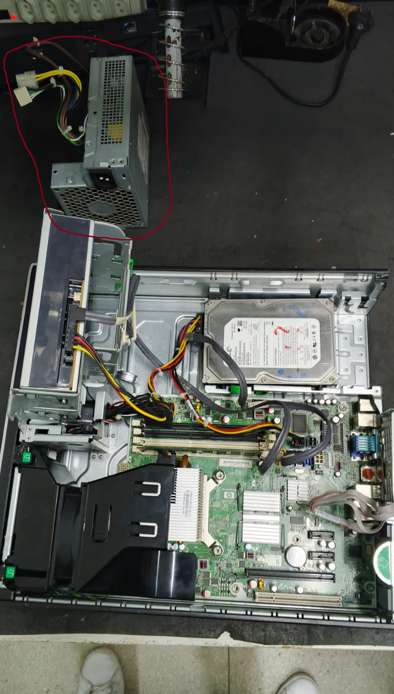

# Tutorial de Desmontagem e Montagem de um PC

## Introdução

Nesse tutorial aprenderemos passo a passo a desmontagem e montagem de um pc desktop da dell.

#### Ferramentas utilizadas no processo:

- Multímetro
- Chave de fenda 3/16”. 
- Chave de fenda 1/8”. 
- Chave Philips #1. 
- Chave Philips #0. 
- Chave de torque T15. 
- Chave de fenda soquete 1/4”. 
- Chave de fenda soquete 3/16”. 
- Chave teste.  
- Alicate de bico longo 5”. 
- Pinça. 
- Pincel para limpeza

## Passo a passo Desmontagem

Só lembrando que um bom técnico em sua desmontagem deve ser sempre organizado!

### Vamos ao passo a passo:

1. Desligue o computador e desconecte todos os cabos e periféricos, como mouse, teclado, monitor, impressora etc.
2. Remova os parafusos que prendem a tampa do gabinete(se houver).
3. Desconectar os conectores da fonte de alimentação.
.jpeg)
4. Retirar fonte de alimentação do gabinete.
   

5. Desinstalar placas de vídeo e de som off-board, se houver.

6. Desinstalar outras placas conectadas à placa-mãe, se houver.
7. Desconectar conectores do gabinete acoplados à placa-mãe (somente gabinetes ATX e ITX).
8. Desconectar cabos de dados.
***(fOTO)***
9. Desafixar unidades de armazenamento secundário (HDDs, SSDs, dispositivos ópticos etc.)
***(fOTO)***
10. Desinstalar memória RAM na placa-mãe.
***(fOTO)***
11. Desinstalar dissipador de calor e ventoinha dos processador.
***(fOTO)***
12. Desinstalar processador na placa-mãe.
***(fOTO)***
13. Desafixar a placa-mãe do chassi metálico do gabinete.
***(fOTO)***
14. Realizar a limpeza.

## Passo a passo Remontagem

1. Preparar o gabinete. Verifique se o mesmo está em boas condições e possui:
- Parafusos para fixação da placa-mãe.
- Parafusos para fixação da fonte de alimentação.
- Parafusos para fixação de unidades de armazenamento.
- Parafusos para fixação de placas de expansão.
- Conectores para os botões de liga/desliga e reset.
- Conectores para os LEDs de atividade.
- Conectores para os conectores de áudio e vídeo, se houver.
- Conectores para os conectores USB.
2. Fixar placa-mãe no chassi metálico do gabinete.
3. Instalar conectores do gabinete à placa-mãe.
4. Conectar periféricos on-board (conectores dos barramentos externos)(se houver).
5. Instalar processador na placa-mãe.
6. Colocar pasta térmica e instalar dissipador e a ventoinha (cooler).
7. Instalar memória RAM na placa-mãe.
8. Instalar placa de vídeo(caso houver).
9. Fixação das unidades de armazenamento secundário (SSDs, HDDs, unidades ópticas)
10. Instalar fonte de alimentação
11. Instalar conectores da fonte de alimentação.
12. Instalar cabos flat.
13. Instalar demais periféricos, caso existam.
14. Conectar mouse, teclado e monitor de vídeo.
15. Conferir tudo: tensão da fonte de alimentação, do estabilizador (se houver), tomada com aterramento.
16. Ligar o PC pela primeira vez.
